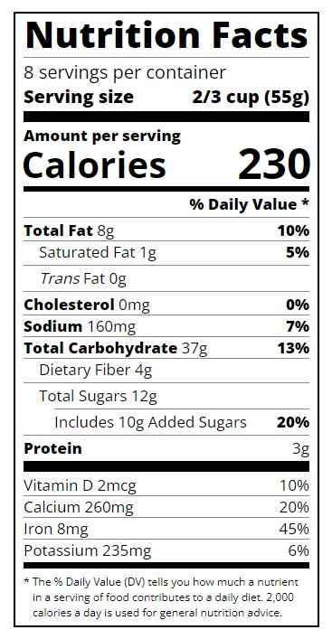

# Nutrition Label

This project is a responsive nutrition label designed using HTML and CSS. It showcases a sample nutrition facts label with various nutrients and their daily values. The code for this project was created based on the studies from the "Responsive Web Design" course on [Free Code Camp](https://www.freecodecamp.org/).

## Preview

## Features

- Responsive design that adjusts to different screen sizes
- Clearly organized information with bold headings and dividers
- Highlighted nutrient values and percentages for easy readability

## Technologies Used

- HTML
- CSS
- Google Fonts (Open Sans)

## Getting Started

1. Clone this repository to your local machine.
2. Open the `index.html` file in your web browser to view the nutrition label.

## CSS Styles

The CSS styles for this project can be found in the `styles.css` file. Here are some key classes and their descriptions:

- `.label`: Container for the nutrition label.
- `.divider`: Horizontal line divider with a gray color.
- `.bold`: Sets the font weight to bold.
- `.large`, `.medium`: Styling for different divider sizes.
- `.small-text`: Sets font size to 0.85rem.
- `.calories-info`: Container for calories information.
- `.indent`, `.double-indent`: Adds left margin for indentation.
- `.daily-value`: Container for daily value percentages.
- `.note`: Styling for additional notes.
